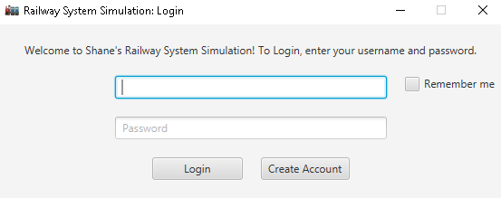
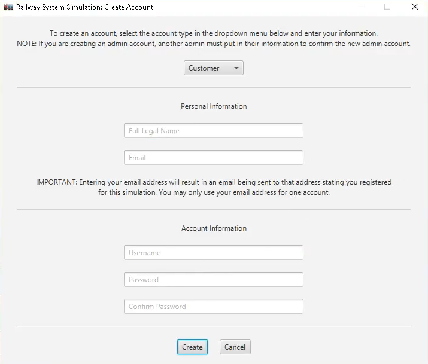
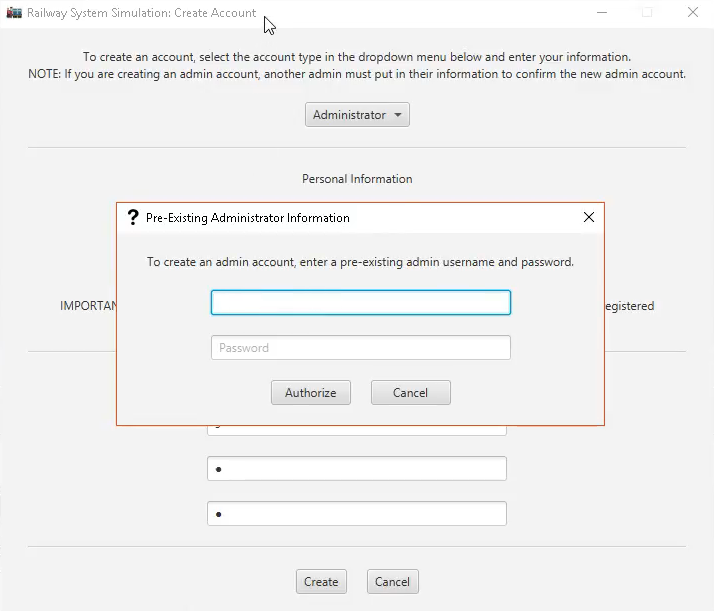
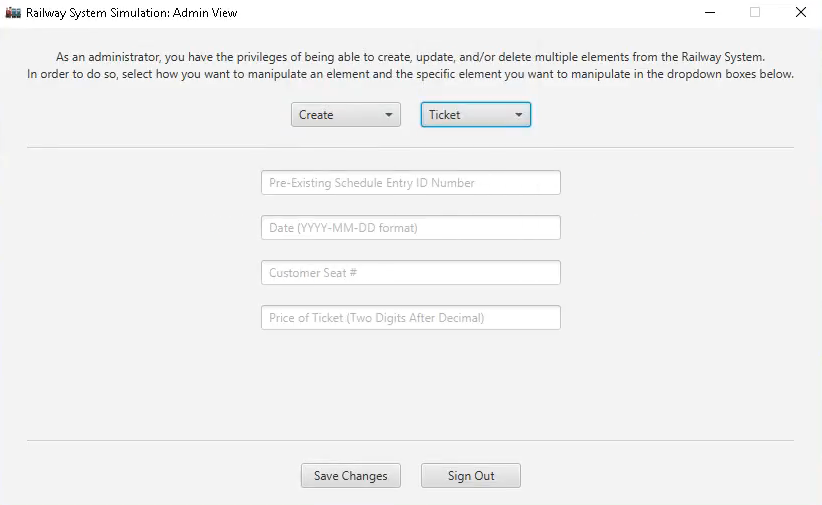
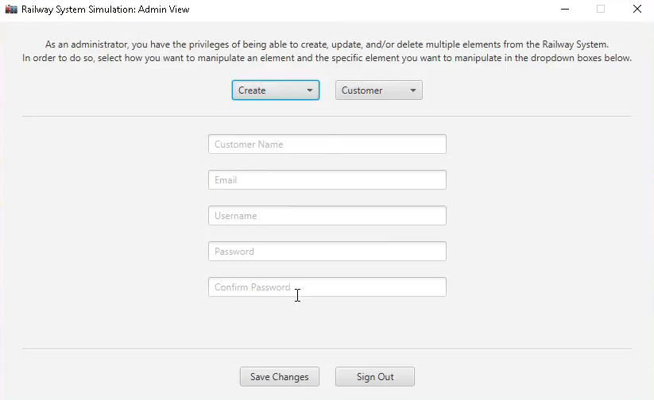
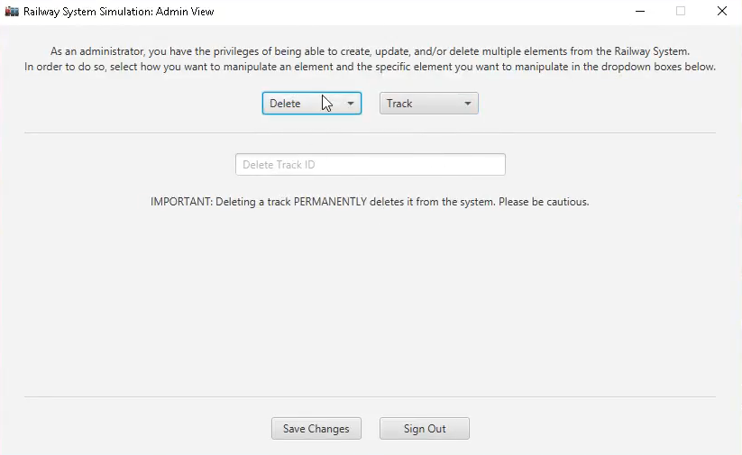
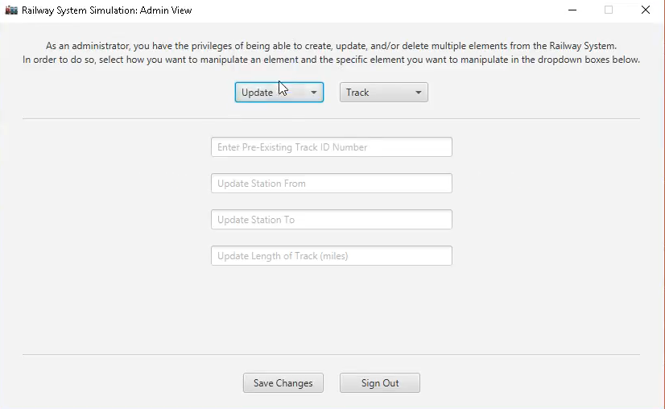

# Railway Management System
###### Official CIS245 (Database Management Sys. /SQL) Final Project by [Shane Staret](https://github.com/SStaret43).
###### This is a link to [my YouTube channel](https://www.youtube.com/channel/UCmQA16swmtPa29pRo9YtRTA?view_as=subscriber), featuring videos of this project on it. Here is a [video](https://www.youtube.com/watch?v=VBhkxXqMgSw&t=268s) that does "well" at explaining and showcasing the basics of the application and some of its flaws.

**IMPORTANT NOTE: The .jar executable file will *NOT* work unless you have Java 1.9 on your device**
________________________________________________________________________________________________________________________________

## **Explanation & Design Process**

#### This software program is a simulation of a railway management system. It effectively manages all of the basic things that a railway system must have: administrators, customers, trains, train stations, schedules, tracks, and tickets. Obviously, in its *current* state the application would not be effective in controlling and managing an actual railway system. However, it handles the basics quite well and is **definitely** something that can be built upon. Before I even began a line of code, I wanted to create a project that didn't just fulfill the requirements of the class, but I also wanted to create something that could realistically be implemented. Thus, I've correctly implemented the foundation of the application so far and have rigourously worked to weed out every known bug. I also have implemented safety checks and created a user friendly UI so that someone does not accidently do an action that was unintended.

#### The most important step in this whole process was actually designing the UI and creating pseudocode before even opening up the IDE to write code. To have an effective railway management system, there are some obvious things that are needed. First, I decided that there were going to be two "classes" of sorts: users and objects. The main idea was that the users I implemented would be able to interact with the objects. From there, I further split up the users into "administrators" and "customers" and created five objects: tickets, trains, train stations, schedules, and tracks. Essentially, administrators could do *everything* (except delete other admins of course) and customers could purchase tickets. So, from the getgo, I realized that customers would have limited access, whereas admins would have complete access. Therefore, two separate views would have to be created to account for the different areas I wanted each user to manipulate. Of course, there would also need to be a login screen to verify a user and there would also have to be a "create account" screen so that new users could join. So, I went about designing these four separate scenes by actually drawing them and thinking about what I would want to see as a user.

#### After designing the frontend, I came up with the most efficient way to organize the backend. The total number of "things" I had was seven--two users and five objects. Obviously, that means within the database there would be at least seven tables and multiple relationships between these users and objects. At this moment, I asked myself, "*What is the main object that this program is built around?*" ...Well considering its a railway management system, obviously the answer is the train...right? Well at first that is what I thought, but I quickly realized that it is actually the ticket. Without the ticket, our entire system collapses. A railway cannot operate without the customers who purchase the ticket and a ticket cannot exist if there is not a train, train station, track, etc. Therefore, the entire program revolves around the ticket and every other object must be properly implemented to ensure that a ticket can be appropriately created and sold for purchase by a customer.

#### When I was finished designing and deciding how I wanted to implement both the frontend and the backend, it was time to code...not much explaining needs to be done there as you can literally view the code and its comments above. Obviously, it will change (and get more fantastic) as I work on the project.
________________________________________________________________________________________________________________________________

## **How it was Made**

#### My Railway Management System is created using JavaFX and its UI along with SQL Server Management Studio. Java is used for frontend implementation, whereas SQL is used for the backend. At the moment, the code is admittedly not efficient. There are definitely some methods that I can create that will not only shorten the length of the code, but will also make the code easier to understand, build upon, and run. I plan on continuing to create this software within Java and SQL and have no intention on switching languages. However, JavaFX does can implement CSS, which I have yet to do. I will definitely do this in the future to make the UI look better. I also think that putting the UI onto the web rather than through Java *may* be something I contemplate doing.
________________________________________________________________________________________________________________________________

## **Thoughts & Future Plans**

#### This project was created with the intent to be a simulation of a railway management system. In its current state, I feel as though this could realistically be implemented as a simplistic application that effectively manages a railway system and all of its components. Obviously, the program still needs to be worked on in order for it to properly function as an actual software program that could control even the most basic railway system. Here is a shortlist of what I will do in the future:
   * ##### fix backend issues in SQL leading to relationships not working properly
   * ##### implement needed methods to avoid repetitive code
   * ##### create classes to house methods so code is more organized and readable
   * ##### add CSS to UI to make it more professional and aesthetic
   * ##### *possibly* move UI to the web
________________________________________________________________________________________________________________________________

## **Pictures**

#### What the Login UI looks like. When the program is run, this is the first scene to show.

#### This is the Create Account UI. Here, an account can be created for either an admin or a customer and the email address entered will receive an email if the address exists.

#### The pop-up box that comes up when an admin account is trying to be created. This authorization window requires a pre-existing admin's information to confirm that a new admin account should actually be created.

#### The email that is sent to a user whenever their account is created or updated.

#### These are some of the many views that an admin can see.

#### This is the Customer UI. Pre-existing customers can purchase unowned tickets here or cancel their owned tickets.

#### 
